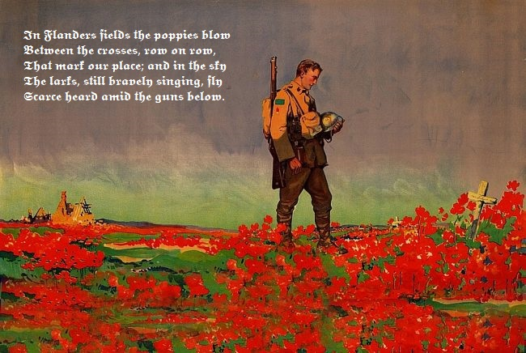
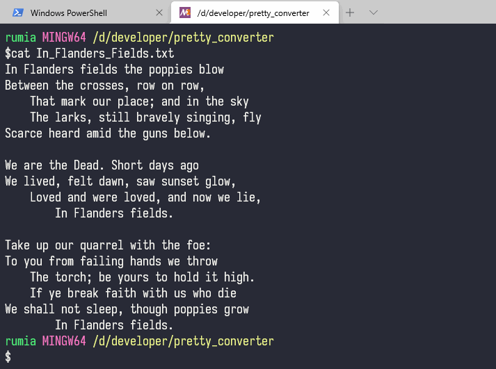

# Pretty Converter


    𝕴𝖓 𝕱𝖑𝖆𝖓𝖉𝖊𝖗𝖘 𝖋𝖎𝖊𝖑𝖉𝖘 𝖙𝖍𝖊 𝖕𝖔𝖕𝖕𝖎𝖊𝖘 𝖇𝖑𝖔𝖜
    𝕭𝖊𝖙𝖜𝖊𝖊𝖓 𝖙𝖍𝖊 𝖈𝖗𝖔𝖘𝖘𝖊𝖘, 𝖗𝖔𝖜 𝖔𝖓 𝖗𝖔𝖜,
    𝕿𝖍𝖆𝖙 𝖒𝖆𝖗𝖐 𝖔𝖚𝖗 𝖕𝖑𝖆𝖈𝖊; 𝖆𝖓𝖉 𝖎𝖓 𝖙𝖍𝖊 𝖘𝖐𝖞
    𝕿𝖍𝖊 𝖑𝖆𝖗𝖐𝖘, 𝖘𝖙𝖎𝖑𝖑 𝖇𝖗𝖆𝖛𝖊𝖑𝖞 𝖘𝖎𝖓𝖌𝖎𝖓𝖌, 𝖋𝖑𝖞
    𝕾𝖈𝖆𝖗𝖈𝖊 𝖍𝖊𝖆𝖗𝖉 𝖆𝖒𝖎𝖉 𝖙𝖍𝖊 𝖌𝖚𝖓𝖘 𝖇𝖊𝖑𝖔𝖜.

Convert alphabet characters to Unicode Mathematical Alphanumeric Symbols. (U+1D400—U+1D6A3)

The non-alphabet characters (commas, colons, semicolons, etc) won't be affected.

将英文字母转换为对应的手写体或哥特体字符

非英文字母（标点符号等）不会受到影响

# Usage
```
Convert alphabet characters to Unicode Mathematical Alphanumeric Symbols.

Usage: ./pretty_converter.rb [OPTION]... [FILE]...

Ooptions:
    -f, --font [FONT]                Use specifed font. You could use the option '-e' to list available fonts. The default is Bold-Script.
    -o, --output [FILE]              Redirect output to file
    -h, --help                       Prints this help
    -e, --example                    Print all Mathematical Alphanumeric Symbols
```

## 中文版
```
用法: ./pretty_converter.rb [选项]... [文件]...

Ooptions:
    -f, --font [字体]                使用指定字体，默认为粗手写体。可以用-e选项查看所有字体。
    -o, --output [文件]              将输出重定向到指定文件中
    -h, --help                       打印帮助信息
    -e, --example                    打印所有的数学字母符号
```

# Screenshot

